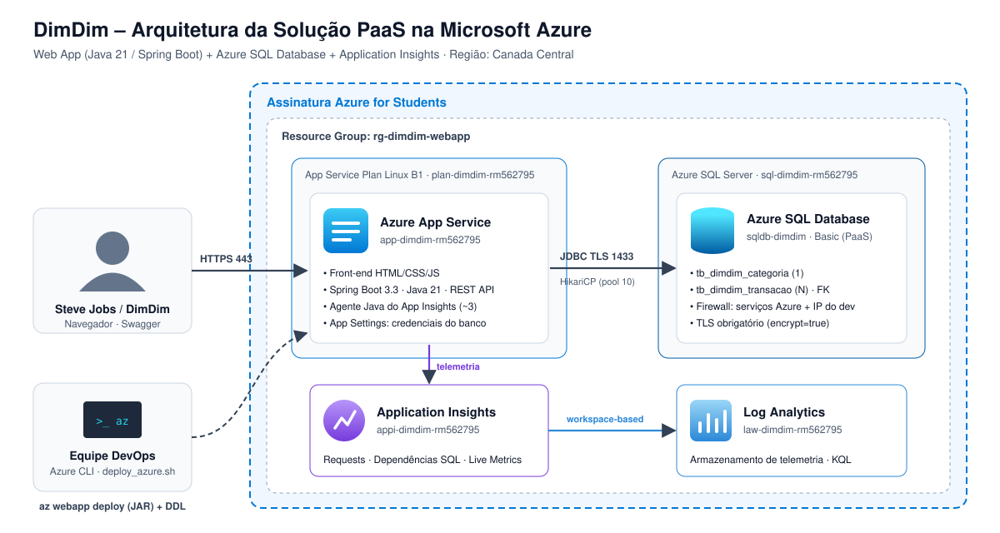

# 🏦 Projeto DimDim — Aplicação Web & Banco de Dados em Nuvem (PaaS)
### 2º Checkpoint – 2º Semestre – DevOps Tools & Cloud Computing
**Faculdade de Informática e Administração Paulista (FIAP)**  
**Professor:** Prof. João Menk (`profjoao.menk@fiap.com.br`)

---

## 👥 Integrantes da Equipe (Grupo DimDim)
- **Gabriel Maciel Alves de Oliveira** — RM562795
- **Vitória Rodrigues Martins** — RM565160
- **Augusto Bonomo Júnior** — RM565155
- **Thomas Fontes** — RM562254
- **Matheus Pereira Molina** — RM563399

---

## 🔗 Links Oficiais da Entrega
- **Repositório GitHub Oficial:** [https://github.com/Gabriel-Maciel06/CPDevopsDInDIn.git](https://github.com/Gabriel-Maciel06/CPDevopsDInDIn.git)
- **Vídeo de Demonstração (YouTube):** `https://youtu.be/SEU_VIDEO_AQUI` *(Mínimo 720p com explicação falada)*
- **URL da Aplicação Web em Produção (Azure):** `https://app-dimdim-rm562795.azurewebsites.net`
- **Documentação Swagger / OpenAPI 3:** `https://app-dimdim-rm562795.azurewebsites.net/swagger-ui.html`
- **Health Check & Telemetria:** `https://app-dimdim-rm562795.azurewebsites.net/api/health`

---

## 📋 1. Descrição da Solução

A consultoria do **Grupo DimDim** foi acionada para desenvolver e validar uma solução corporativa de **Gestão Financeira & Análise de Transações** para **Steve Jobs** e a diretoria da **DimDim**.

Antes do lançamento oficial da plataforma no ecossistema Apple/DimDim, foi exigida a execução de um **teste em ambiente de nuvem real**, utilizando serviços nativos de **Plataforma como Serviço (PaaS)** da **Microsoft Azure**:

1. **Hospedagem da Aplicação (PaaS):** **Azure App Service (Linux Web App)** executando aplicação Java 21 LTS com Spring Boot 3.3.4, garantindo escalabilidade automática, alta disponibilidade, certificados SSL/TLS gerenciados e isolamento.
2. **Banco de Dados Relacional (PaaS - Obrigatório):** **Azure SQL Database (Microsoft SQL Server)** nativo e gerenciado, sem uso de containers, garantindo replicação e conformidade ACID com relacionamento relacional entre tabelas (`1:N`).
3. **Observabilidade & Monitoramento Contínuo:** **Azure Application Insights** com Java In-Process Agent, monitorando tempos de resposta HTTP, dependências JDBC do banco de dados SQL Server, latência de consultas e rastreamento de transações em tempo real.
4. **Interface Front-End Web Integrada (Bônus de +1 Ponto):** Painel web responsivo (tema Apple/DimDim Fintech), permitindo operações visuais de CRUD em tempo real, visualização de KPIs e telemetria de latência do banco diretamente pelo navegador.
5. **Automação de Infraestrutura & Deploy:** Provisionamento 100% reproduzível via **Azure CLI** (`scripts/deploy_azure.sh`) e deploy do pacote via `az webapp deploy`. Um pipeline **GitHub Actions** opcional está disponível em `scripts/github-actions-workflow.yml`.

---

## 🏛️ 2. Desenho Macro da Arquitetura da Solução

### 2.1 Diagrama de Arquitetura em Nuvem (PaaS)



### 2.2 Visão textual da arquitetura
```
                                        MICROSOFT AZURE CLOUD (PaaS)
                                ┌────────────────────────────────────────────────────────┐
                                │                                                        │
   ┌───────────────────────┐    │   ┌────────────────────────────────────────────────┐   │
   │   Cliente / Browser   │    │   │         Azure App Service (Linux Web App)      │   │
   │  (Steve Jobs / DimDim)│    │   │             [app-dimdim-rm562795]              │   │
   └───────────┬───────────┘    │   │                                                │   │
               │ HTTPS (443)    │   │  • Front-End Web Responsivo (HTML5/CSS3/JS)    │   │
               ├────────────────┼──>│  • Spring Boot 3.3.4 (Java 21 LTS)             │   │
               │                │   │  • REST API & Swagger OpenAPI 3                │   │
               │                │   │  • App Insights Java Agent In-Process          │   │
   ┌───────────┴───────────┐    │   └───────────────┬───────────────────┬────────────┘   │
   │   Desenvolvedor / CI  │    │                   │                   │                │
   │   • Azure CLI Script  │    │       TCP 1433    │                   │ Telemetria     │
   │   • az webapp deploy  │───-┼──────────┐        │ JDBC Seguro       │ e Métricas     │
   └───────────────────────┘    │          │        ▼                   ▼                │
                                │   ┌──────────────┴────────┐   ┌────────────────────┐   │
                                │   │  Azure SQL Database   │   │ Azure Application  │   │
                                │   │  (PaaS - SQL Server)  │   │      Insights      │   │
                                │   │                       │   │                    │   │
                                │   │ [sqldb-dimdim]        │   │ • Live Metrics     │   │
                                │   │ • tb_dimdim_categoria │   │ • Application Map  │   │
                                │   │ • tb_dimdim_transacao │   │ • SQL Latency      │   │
                                │   └───────────────────────┘   └─────────┬──────────┘   │
                                │                                         │              │
                                │                                         ▼              │
                                │                               ┌────────────────────┐   │
                                │                               │ Log Analytics      │   │
                                │                               │ Workspace          │   │
                                │                               └────────────────────┘   │
                                └────────────────────────────────────────────────────────┘
```


---

## 🗄️ 3. Modelagem de Dados & Relacionamentos (Azure SQL Server)

A solução implementa **duas tabelas relacionais com cardinalidade 1:N** com integridade referencial estrita e índices de performance:

```
┌─────────────────────────────────┐                 ┌─────────────────────────────────┐
│     tb_dimdim_categoria         │                 │      tb_dimdim_transacao        │
├─────────────────────────────────┤                 ├─────────────────────────────────┤
│ PK  id               (BIGINT)   │◄───────────────┐│ PK  id               (BIGINT)   │
│     nome             (VARCHAR)  │                ││     descricao        (VARCHAR)  │
│     tipo             (VARCHAR)  │                ││     valor            (DECIMAL)  │
│     icone            (VARCHAR)  │                ││     data_transacao   (DATE)     │
│     descricao        (VARCHAR)  │                ││     tipo             (VARCHAR)  │
│     data_criacao     (DATETIME2)│                ││     metodo_pagamento (VARCHAR)  │
└─────────────────────────────────┘                └───┼FK categoria_id     (BIGINT)   │
                                                        │     observacoes      (VARCHAR)  │
                                                        │     status           (VARCHAR)  │
                                                        │     data_registro    (DATETIME2)│
                                                        └─────────────────────────────────┘
```

- **Tabela 1 (`tb_dimdim_categoria`):** Gerencia as categorias orçamentárias (ex: "Consultoria Cloud & Inovação", "Infraestrutura Cloud Azure").
- **Tabela 2 (`tb_dimdim_transacao`):** Registra as movimentações financeiras com valor, tipo (`RECEITA` ou `DESPESA`), método de pagamento, status e vínculo de chave estrangeira (`categoria_id` ➔ `tb_dimdim_categoria.id`).

O script DDL completo está disponível em [`scripts/ddl_tables.sql`](scripts/ddl_tables.sql).

---

## 🚀 4. How-To Completo: Implantação Automatizada em Nuvem

### 4.1 Pré-requisitos
- Conta ativa na Microsoft Azure (ex: **Azure for Students**).
- **Azure CLI (`az`)** instalado e autenticado (`az login`).
- **Java JDK 21 LTS** e **Apache Maven 3.9+** instalados.

### 4.2 Implantação em Um Único Comando (100% Automatizada)
Na raiz do repositório, execute o script de automação:

```bash
chmod +x scripts/deploy_azure.sh
export SQL_ADMIN_PASS='<sua-senha-forte>'   # ou deixe em branco: o script solicitará a senha
./scripts/deploy_azure.sh
```

### 4.3 Passo a Passo Detalhado dos Comandos Azure CLI Executados

Caso prefira executar os comandos manualmente passo a passo:

#### 1. Definir variáveis de ambiente
```bash
RESOURCE_GROUP="rg-dimdim-webapp"
LOCATION="canadacentral"
SQL_SERVER="sql-dimdim-rm562795"
SQL_DB="sqldb-dimdim"
SQL_ADMIN="dimdimadmin"
read -rsp "Senha do admin SQL: " SQL_PASS; echo   # nunca versionar a senha
APP_PLAN="plan-dimdim-rm562795"
WEBAPP_NAME="app-dimdim-rm562795"
WORKSPACE_NAME="law-dimdim-rm562795"
APP_INSIGHTS="appi-dimdim-rm562795"
```

#### 2. Criar Grupo de Recursos
```bash
az group create --name $RESOURCE_GROUP --location $LOCATION
```

#### 3. Criar Azure SQL Server e Banco de Dados (PaaS)
```bash
# Provisionar servidor SQL Server
az sql server create \
    --name $SQL_SERVER \
    --resource-group $RESOURCE_GROUP \
    --location $LOCATION \
    --admin-user $SQL_ADMIN \
    --admin-password $SQL_PASS

# Liberar acesso a serviços Azure no Firewall (0.0.0.0)
az sql server firewall-rule create \
    --resource-group $RESOURCE_GROUP \
    --server $SQL_SERVER \
    --name "AllowAllWindowsAzureIps" \
    --start-ip-address 0.0.0.0 \
    --end-ip-address 0.0.0.0

# Liberar seu IP atual para testes diretos
MY_IP=$(curl -s https://api.ipify.org)
az sql server firewall-rule create \
    --resource-group $RESOURCE_GROUP \
    --server $SQL_SERVER \
    --name "AllowClientIp" \
    --start-ip-address $MY_IP \
    --end-ip-address $MY_IP

# Criar banco de dados Azure SQL (Tier Basic PaaS econômico)
az sql db create \
    --resource-group $RESOURCE_GROUP \
    --server $SQL_SERVER \
    --name $SQL_DB \
    --edition Basic
```

#### 4. Criar Application Insights e Log Analytics (Monitoramento)
```bash
az monitor log-analytics workspace create \
    --resource-group $RESOURCE_GROUP \
    --workspace-name $WORKSPACE_NAME \
    --location $LOCATION

WORKSPACE_ID=$(az monitor log-analytics workspace show \
    --resource-group $RESOURCE_GROUP \
    --workspace-name $WORKSPACE_NAME \
    --query id -o tsv)

az monitor app-insights component create \
    --app $APP_INSIGHTS \
    --location $LOCATION \
    --resource-group $RESOURCE_GROUP \
    --workspace $WORKSPACE_ID

APP_INSIGHTS_KEY=$(az monitor app-insights component show \
    --app $APP_INSIGHTS \
    --resource-group $RESOURCE_GROUP \
    --query connectionString -o tsv)
```

#### 5. Criar App Service Plan e Web App Linux
```bash
# Criar Plano B1 Linux
az appservice plan create \
    --name $APP_PLAN \
    --resource-group $RESOURCE_GROUP \
    --location $LOCATION \
    --is-linux \
    --sku B1

# Criar Web App com Runtime Java 21
az webapp create \
    --name $WEBAPP_NAME \
    --resource-group $RESOURCE_GROUP \
    --plan $APP_PLAN \
    --runtime "JAVA:21-java21"
```

#### 6. Configurar Variáveis de Ambiente Seguras no Web App
```bash
JDBC_URL="jdbc:sqlserver://${SQL_SERVER}.database.windows.net:1433;database=${SQL_DB};encrypt=true;trustServerCertificate=false;hostNameInCertificate=*.database.windows.net;loginTimeout=30;"

az webapp config appsettings set \
    --name $WEBAPP_NAME \
    --resource-group $RESOURCE_GROUP \
    --settings \
        AZURE_SQL_URL="$JDBC_URL" \
        AZURE_SQL_USERNAME="$SQL_ADMIN" \
        AZURE_SQL_PASSWORD="$SQL_PASS" \
        AZURE_SQL_DRIVER="com.microsoft.sqlserver.jdbc.SQLServerDriver" \
        SPRING_PROFILES_ACTIVE="azure" \
        APPLICATIONINSIGHTS_CONNECTION_STRING="$APP_INSIGHTS_KEY" \
        ApplicationInsightsAgent_EXTENSION_VERSION="~3"
```

> As credenciais ficam apenas nos **App Settings** do Web App (criptografados pela Azure) e nunca no código-fonte.

#### 6.1 Criar as tabelas no Azure SQL (DDL)
Antes do primeiro acesso à aplicação, execute o DDL oficial:
- **Portal:** Azure SQL Database `sqldb-dimdim` ➔ **Query editor** ➔ login com `dimdimadmin` ➔ cole o conteúdo de [`scripts/ddl_tables.sql`](scripts/ddl_tables.sql) ➔ **Run**.
- **Ou via CLI** (com [sqlcmd](https://learn.microsoft.com/sql/tools/sqlcmd/sqlcmd-utility) instalado): o `deploy_azure.sh` aplica o DDL automaticamente se as tabelas ainda não existirem.

```bash
SQLCMDPASSWORD="$SQL_PASS" sqlcmd -S ${SQL_SERVER}.database.windows.net -d $SQL_DB -U $SQL_ADMIN -i scripts/ddl_tables.sql
```

> O DDL usa `NVARCHAR` nas colunas de texto livre para armazenar acentos e emojis corretamente.

#### 7. Compilar e Fazer Deploy do Pacote JAR
```bash
mvn clean package -DskipTests

az webapp deploy \
    --resource-group $RESOURCE_GROUP \
    --name $WEBAPP_NAME \
    --src-path target/dimdim-webapp-1.0.0.jar \
    --type jar \
    --clean true \
    --restart true
```

---

## 🧠 4.4 Regras de Negócio Implementadas
- **Integridade 1:N:** uma categoria com transações vinculadas **não pode ser excluída** (HTTP `409 Conflict`); exclua ou mova as transações antes.
- **Coerência de tipo:** uma transação `RECEITA` só pode ser vinculada a uma categoria `RECEITA` (e vice-versa) — HTTP `422`.
- **Nome único:** não é permitido cadastrar/renomear categorias com nome duplicado (HTTP `409`, também garantido por `UNIQUE` no banco).
- **Erros padronizados:** respostas de erro no formato `{ "timestamp", "status", "message", "errors" }`.

---

## 💻 5. Demonstração do Front-End Web (+1 Ponto Bônus)

A aplicação conta com interface web moderna desenvolvida especificamente para o tema do estudo de caso **DimDim & Steve Jobs**, acessível diretamente na raiz do Web App (`/`):

- **Painel Executivo:** Indicadores em tempo real de Saldo Líquido, Total de Receitas e Despesas consolidadas a partir do Azure SQL.
- **Gestão de Transações:** Tabela com busca, filtros por tipo, paginação visual, e modal interativo para **Criar**, **Editar** e **Excluir** movimentações.
- **Gestão de Categorias:** Painel de categorias orçamentárias com emojis representativos, tipo e contagem de transações associadas.
- **Telemetria ao Vivo:** Widget de monitoramento exibindo latência de consulta direta ao Azure SQL e status do Application Insights.

---

## 📡 6. JSON das Operações CRUD (REST API)

Todos os exemplos de requisição e resposta estão armazenados na pasta [`tests/`](tests/):

### 6.1 Tabela 1: Categorias (`/api/categorias`)
| Operação | Método | Endpoint | Arquivo de Exemplo |
|---|---|---|---|
| Criar Categoria | `POST` | `/api/categorias` | [`tests/categoria_post.json`](tests/categoria_post.json) |
| Listar / Buscar | `GET` | `/api/categorias/1` | [`tests/categoria_get.json`](tests/categoria_get.json) |
| Atualizar | `PUT` | `/api/categorias/1` | [`tests/categoria_put.json`](tests/categoria_put.json) |
| Excluir | `DELETE` | `/api/categorias/1` | [`tests/categoria_delete.json`](tests/categoria_delete.json) |

**Exemplo POST Categoria:**
```json
{
  "nome": "Consultoria Steve Jobs & Apple Cloud",
  "tipo": "RECEITA",
  "icone": "🍏",
  "descricao": "Projetos de arquitetura e consultoria PaaS para ecossistema Apple"
}
```

### 6.2 Tabela 2: Transações (`/api/transacoes`)
| Operação | Método | Endpoint | Arquivo de Exemplo |
|---|---|---|---|
| Criar Transação | `POST` | `/api/transacoes` | [`tests/transacao_post.json`](tests/transacao_post.json) |
| Listar / Buscar | `GET` | `/api/transacoes/1` | [`tests/transacao_get.json`](tests/transacao_get.json) |
| Atualizar | `PUT` | `/api/transacoes/1` | [`tests/transacao_put.json`](tests/transacao_put.json) |
| Excluir | `DELETE` | `/api/transacoes/1` | [`tests/transacao_delete.json`](tests/transacao_delete.json) |

**Exemplo POST Transação:**
```json
{
  "descricao": "Aquisição de Infraestrutura PaaS Azure Web App & SQL",
  "valor": 2850.75,
  "dataTransacao": "2026-10-05",
  "tipo": "DESPESA",
  "metodoPagamento": "CARTAO_CREDITO",
  "categoriaId": 3,
  "observacoes": "Provisionamento de ambiente de testes para Steve Jobs",
  "status": "CONCLUIDA"
}
```

---

## 📊 7. Monitoramento com Azure Application Insights

Para visualizar a telemetria no Portal Azure:
1. Acesse o **Portal Azure** (`portal.azure.com`) ➔ Resource Group `rg-dimdim-webapp`.
2. Abra o recurso **Application Insights** (`appi-dimdim-rm562795`).
3. **Application Map (Mapa do Aplicativo):** Visualize a topologia conectando o Web App Linux ao **Azure SQL Database** via dependência JDBC.
4. **Live Metrics (Métricas em Tempo Real):** Abra a aba **Live Metrics** e realize chamadas CRUD no Front-End ou via Postman para observar requisições/s, CPU, memória e latência em tempo real.
5. **Logs & KQL (Transações do Banco):** Execute a query abaixo em **Logs** para inspecionar as queries SQL executadas:
   ```kql
   dependencies
   | where type == "SQL" or target contains "database.windows.net"
   | project timestamp, name, data, duration, success, resultCode
   | order by timestamp desc
   ```

---

## 🎬 8. Roteiro Passo a Passo para Gravação do Vídeo (Gabarito da Avaliação)

> **Exigências do Professor:** Vídeo falado, mínimo 720p, demonstrando todo o ciclo de vida. Duração recomendada: 5 a 7 minutos.

| Tempo | Etapa | O que mostrar e falar |
|---|---|---|
| **00:00 - 00:45** | **Apresentação** | Apresentar os integrantes do grupo, RMs, e introduzir o desafio da consultoria DimDim para Steve Jobs com Web App e Azure SQL. |
| **00:45 - 02:00** | **Recursos na Azure** | Mostrar no Azure CLI (`az resource list -g rg-dimdim-webapp -o table`) e no Portal Azure: o Web App Linux, o Azure SQL Server com o banco `sqldb-dimdim`, e o Application Insights. |
| **02:00 - 05:00** | **CRUD + Persistência (alternando Front ↔ Query Editor)** | Deixe o Web App e o **Query Editor** do Azure SQL abertos lado a lado. **Após cada operação, rode o SELECT correspondente** (exigência do professor, −3 pts se faltar): <br>**Categoria:** POST (criar) ➔ `SELECT * FROM tb_dimdim_categoria` · GET (listar) · PUT (editar) ➔ SELECT · <br>**Transação** (na categoria nova): POST ➔ `SELECT * FROM tb_dimdim_transacao` · GET · PUT (alterar valor) ➔ SELECT · DELETE ➔ SELECT · <br>**Categoria:** DELETE (agora sem transações) ➔ SELECT. |
| **05:00 - 06:15** | **Application Insights** | Abrir o Application Insights no Portal. Mostrar o **Application Map** conectando Web App ao SQL Database, e a aba **Live Metrics** ou **Transaction search** registrando as chamadas de banco. |
| **06:15 - 06:45** | **Encerramento** | Conclusão demonstrando que todos os critérios foram atendidos com sucesso sem uso de localhost. |

---

## ⚠️ 9. Limitações Conhecidas (escopo de PoC)
- API e front-end **sem autenticação** (ambiente de teste solicitado por Steve Jobs); para produção, adicionar Entra ID / OAuth2.
- Firewall do SQL com a regra `AllowAllWindowsAzureIps`; em produção, usar **VNet Integration + Private Endpoint**.
- A aplicação usa o login administrador do servidor; em produção, usar **Managed Identity** ou um usuário contido com privilégios mínimos.
- Listagens sem paginação no servidor (volume de dados de teste).

---

## 🧹 10. Limpeza de Recursos (Desprovisionamento)
Para não consumir os créditos da assinatura após a correção do professor:
```bash
./scripts/cleanup_azure.sh
```
